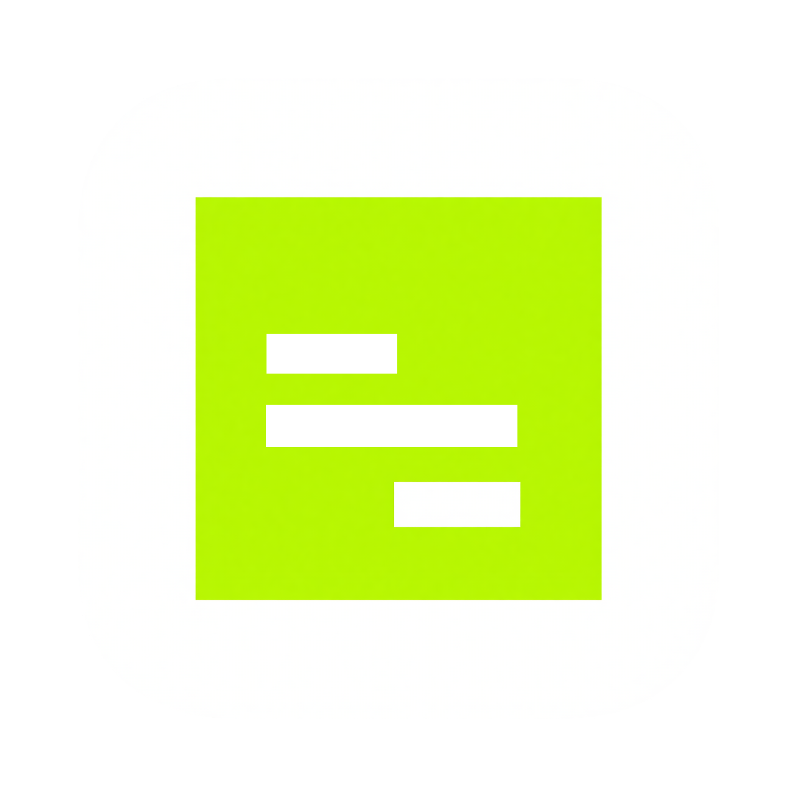

# JereIDE

<div align="center" style="background-color: #000000;">
    
</div>


JereIDE is a powerful and user-friendly Integrated Development Environment (IDE) designed specifically for Python programming. It is a fork of Python's IDLE, built on top of idlelib with enhancements and customizations.

## Installation

Download the [latest release](about:blank) from my website.
I do not have it notarized, so right-click on the downloaded file and select "Open" to run it to bypass Gatekeeper.
Or, you can build it from the source: [Raw Installation](#raw-installation)

## Features

- **Interactive Shell** - Python REPL with syntax highlighting
- **Multi-file Editor** - Edit multiple Python files with tabs
- **Syntax Highlighting** - Colorized Python code
- **Code Completion** - Auto-complete for Python keywords and identifiers
- **Call Tips** - Function signature hints
- **Debugger** - Step-through debugging with breakpoints
- **Indentation Guides** - Visual indentation support
- **Search & Replace** - Find and replace in files with regex support
- **Path Browser** - Navigate Python module paths
- **Class Browser** - Explore class and function definitions
- **Customizable** - Configurable themes, fonts, and keybindings
- **Cross-platform** - Works on macOS, Windows, and Linux

## Raw Installation

### Requirements

- Python 3.6 or higher
- Tcl/Tk 8.5 or later

### Running JereIDE

```bash
python launch.py
```

Or alternatively:

```bash
python -m idlelib.jereide
```

## Project Structure

```
JereIDE/
├── launch.py          # Main entry point
├── idlelib/           # Core IDE package
│   ├── jereide.py     # Alternative entry point
│   ├── pyshell.py     # Python shell implementation
│   ├── editor.py      # Text editor window
│   ├── config.py      # Configuration management
│   └── ...            # Other modules
```

## Development

### Setup

1. Clone the repository:
   ```bash
   git clone https://github.com/yourusername/JereIDE.git
   cd JereIDE
   ```

2. Run the application:
   ```bash
   python3 launch.py
   ```

### Running Tests

Tests are located in `idlelib/idle_test/`. Run them with:

```bash
python -m unittest discover -s idlelib/idle_test
```

## Contributing

Contributions are welcome! Please feel free to submit a Pull Request.

## Credits

JereIDE is based on Python's IDLE (idlelib), originally developed by Guido van Rossum and maintained by the Python community.

## License

This project inherits the same license as Python (PSF License Agreement). See the Python Software Foundation License for details.
